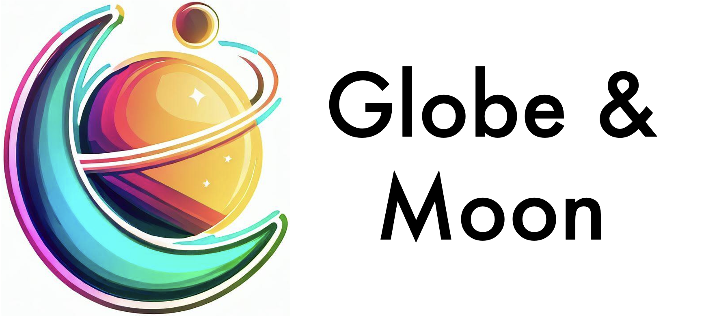

# Graph-learned orbital embeddings (Globe) & Molecular orbital network (Moon)

Reference implementation of Globe and Moon from<br>
[Generalizing Neural Wave Functions](https://arxiv.org/abs/2302.04168)<br>
by Nicholas Gao and Stephane Günnemann<br>
published at ICML 2023.

## Installation
1. Create a new conda environment:
    ```bash
    conda create -n globe python=3.11 # python>=3.10
    conda activate globe
    ```
2. Install [JAX](https://github.com/google/jax). On our cluster, we use
    ```bash
    conda install cudatoolkit=11.7 cudatoolkit-dev=11.7 cudnn=8.8 -c conda-forge
    pip install --upgrade "jax[cuda11_local]" -f https://storage.googleapis.com/jax-releases/jax_cuda_releases.html
    conda env config vars set LD_LIBRARY_PATH=$CONDA_PREFIX/lib/ # this requires reactivating the conda env
    ```
3. Install `globe`:
    ```bash
    pip install -e .
    ```

## Starting experiments
There are two simple ways of training neural wave functions:
1) Using the CLI to start a single experiment.
2) Using [`seml`](https://github.com/TUM-DAML/seml) to start job arrays on a SLURM cluster.

### CLI
The CLI is a simple way to start a single experiment. You can provide additional configuration files or overwrite parameters.
For instance, to train a model on the N2 PES:
```bash
python train_many.py with configs/systems/n2.yaml
```
If you now want to increase the number of determinants, simply overwrite the parameter:
```bash
python train_many.py with configs/systems/n2.yaml globe.determinants=32
```

### seml
To schedule multiple jobs, we recommend to use [`seml`](https://github.com/TUM-DAML/seml). `seml` takes a configuration file with defined parameter spaces and schedules a separate slurm job for each experiment. For instance, to train on the `H4`, `H6` and `H10` from the paper, simply run:
```bash
seml globe_hydrogen add configs/seml/train_hydrogen.yaml
```


## Citation
Please cite our paper if you use our method or code in your own works:
```
@inproceedings{gao_globe_2023,
    title = {Generalizing Neural Wave Functions},
    author = {Gao, Nicholas and G{\"u}nnemann, Stephan}
    booktitle = {International Conference on Machine Learning (ICML)},
    year = {2023}
}
```

---
The logo is generated by [Bing Image Creator](https://www.bing.com/create).
